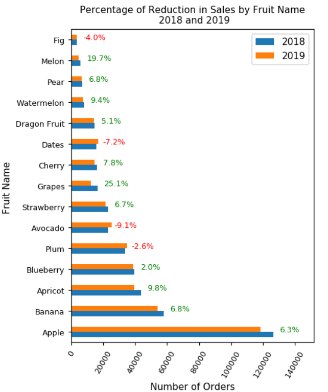
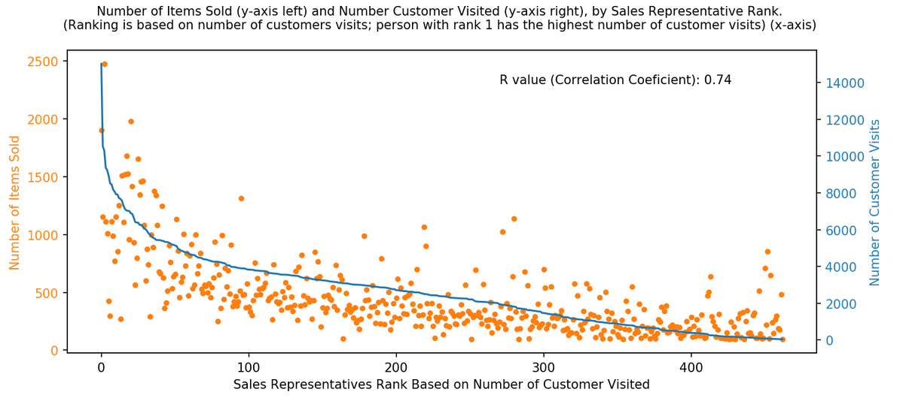

# Cool-Visualizations

This is where I keep the codes for my combination charts.

<h2>1) Bar chart with two variables in x-axis and custom annotations showing the change in each bar</h2>

You can use this code for:
* Bar chart with two variables in x-axis
* Custom annotations showing change for comparison

In this part of code, we will show how to create a bar chart with two variables in x-axis so that the bars related to each variable are separated by a different color. We will also have custom annotations that show the difference between bars of each category. For example, the annotations could show the difference in sales from one year to another.  

   

<h2>2) A combination Chart Showing Correlation Between Two Variables With R-Value as an Annotation</h2>

This is a good visualization for when you want to see if there is a correlation between two variables. For example, if you want to see whether or not there is a correlation between the number of customer visits of the sales representatives and the number of items sold, you can map the two variables on the same chart, one could be a scatter plot, and the other a line plot. You can also calculate the R Value (Correlation Coefficient) and show it on the plot as an annotation. 
  
  
The chart above shows there is a stron correlation (R = 0.74) Between the number of customer visits and the number of items we sell. Each orange dot on the plot represents a sales representative.

   

<h2>2) Annotation With Arrow</h2>

This is a good way of pointing something interesting on your plot. Lets say you want to point the reduction in sales between 2018 and 2019, then you can use an arrow to point it. You can also acompany it with a text showing the percentage in the reduction.
 

