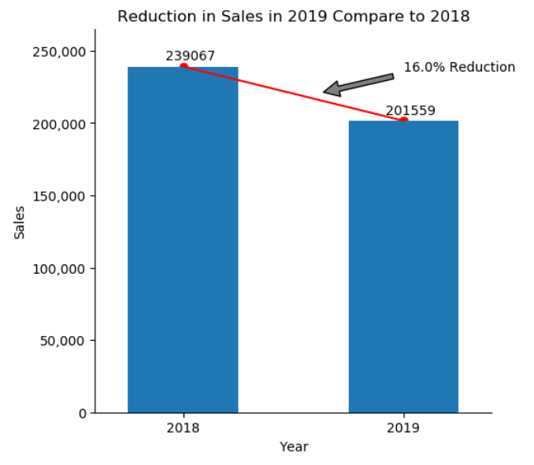

# Cool-Visualizations

This is where I keep the codes for my combination charts.

<h2>1) Bar chart with two variables in x-axis and custom annotations showing the change in each bar</h2>

You can use this code for:
* Bar chart with two variables in x-axis
* Custom annotations showing change for comparison

In this part of code, we will show how to create a bar chart with two variables in x-axis so that the bars related to each variable are separated by a different color. We will also have custom annotations that show the difference between bars of each category. For example, the annotations could show the difference in sales from one year to another.  

   

<h2>2) A combination Chart Showing Correlation Between Two Variables With R-Value as an Annotation</h2>

This is a good visualization for when you want to see if there is a correlation between two variables. For example, if you want to see whether or not there is a correlation between the number of customer visits of the sales representatives and the number of items sold, you can map the two variables on the same chart, one could be a scatter plot, and the other a line plot. You can also calculate the R Value (Correlation Coefficient) and show it on the plot as an annotation. 
  
  
The chart above shows there is a stron correlation (R = 0.74) Between the number of customer visits and the number of items we sell. Each orange dot on the plot represents a sales representative.

   

<h2>2) Annotation With Arrow</h2>

This is a good way of pointing something interesting on your plot. Lets say you want to point the reduction in sales between 2018 and 2019, then you can use an arrow to point it. You can also acompany it with a text showing the percentage in the reduction.
 

   
<h2>2) Comparing Values with Dumbbell Chart</h2>

This chart is a combination of a line chart and a dumbbell chart. This is a perfect way of showing change in multiple variables. Lets say showing change in number of sales by sales representatives. We combined the dumbbell chart with a line graph and also annotations to make the chart even better for making the comparision. In this chart, we assumed there are 100 sales representatives, an we ranked them based on their sales in 2018 (this is a dummy data we created), so the line chart shows the ranking, meaning that the sales person number 1 has the highest sales (at ), and the tail if the line chart shows the lowest sales pesons based on their sales performance. Now the dumbbell chart shows how much each sales person has changed in 2019 compared to 2018. So, the dots that are above the line, are the ones whose performance has increased( we also panted them in green) and the distance between the line and the dot shows the amount of increase in their performance. And the dots that are below the line are the sales persons whose performance has decreased (we painted them in red).  
In addition, what maked this chart even more specific is that we put an annotation on it that has an arrow pointing to a dot that is representing the sales person who is going to receive this report. With this report, each sales person could see where they were in 2018 compared to their peers and also how every sales person has changed (anonymously), and where they stand compared to others.  
If you would like to use the code, please refer to Cool Visualizations.ipynb file in the repository.  

